# Wordpress-en-tres-niveles
# Índice
# 1. Creación del fichero Vagrantfile
# 2. Creación de los scripts de aprovisionamiento
# 3. Configuración de la maquina Mysql
# 4. Configuración de la maquina NFS
# 5. Configuración de la maquinas Nginx
# 6. Configuración de la maquina Balanceador
# 7. Comprobación

## 1. Creación del fichero Vagrantfile
Creo 5 máquinas (un balanceador, dos nginx, un nfs y una mysql) mediante el fichero Vagrantfile

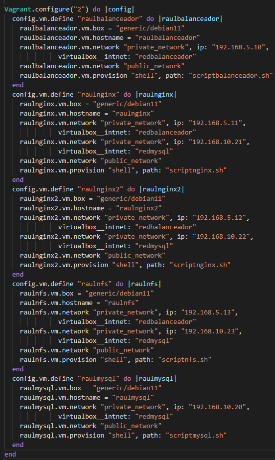

## 2. Creación de los scripts de aprovisionamiento
Creo los ficheros de aprovisionamiento para las diferentes maquinas

### 2.1 Fichero scriptbalanceador.sh

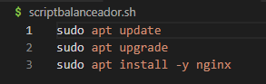

### 2.2 Fichero scriptmysql.sh

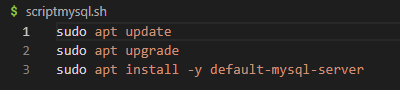

### 2.3 Fichero scriptnfs.sh

### 2.4 Fichero scriptnginx.sh

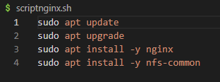

## 3. Configuración de la maquina Mysql

### 3.1 Configuración del fichero 50-server.cnf
Lo primero que hago es modificar el fichero 50-server.cnf que se encuentra en la ruta /etc/mysql/mariadb.conf.d y cambiar el bind-address por la ip de la maquina mysql.

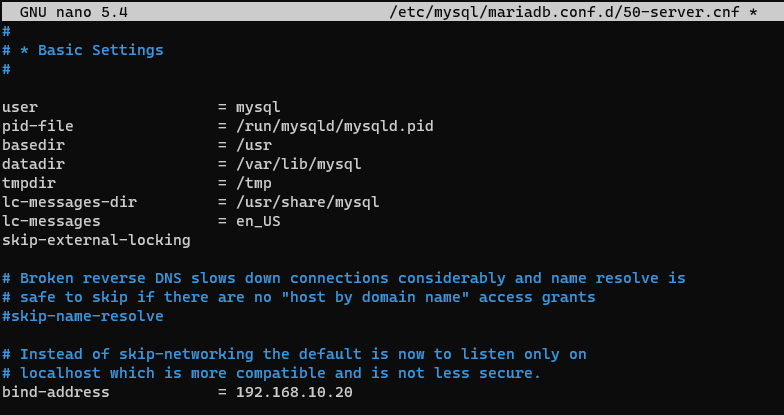

### 3.2 Ejecutar mysql_secure_installation
Lo siguiente es ejecutar el mysql_secure_installation para poder cambiar la contraseña del usuario root para poder entrar.

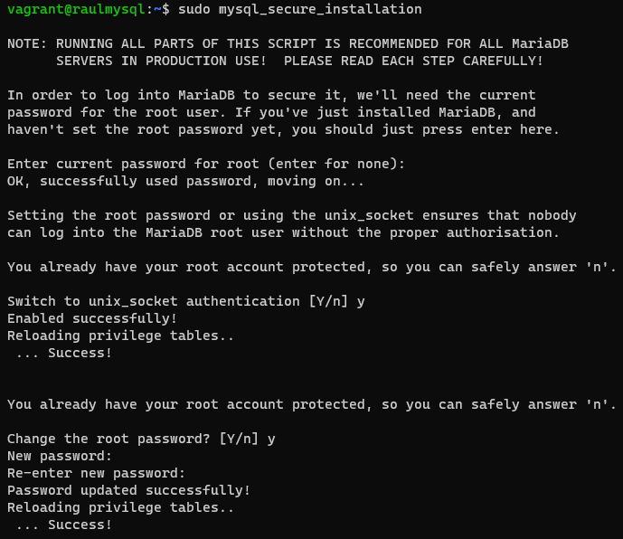

### 3.3 Creación del usuario y de la base de datos
Después de cambiar la contraseña de root se crea el usuario y la base de datos para prestashop

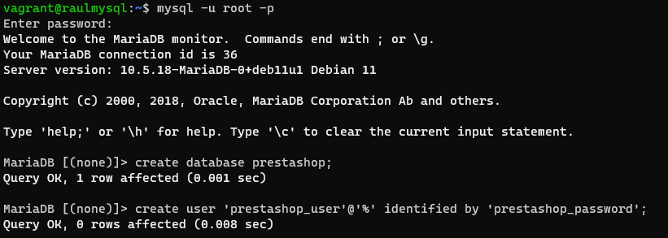

A continuación le damos todos los permisos en la base de datos creada al usuario creado 

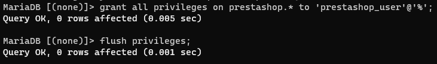

## 4. Configuración de la maquina NFS

### 4.1 Descargar el wget y el wordpress.
Descargamos si no lo tenemos el wget y con eso descargamos el wordpress

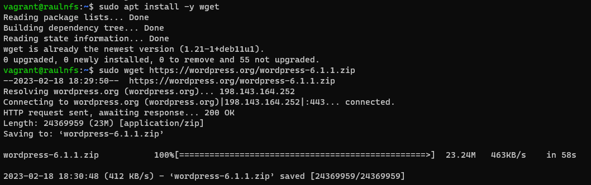

### 4.2 Descomprimir el archivo de wordpress
Descargamos el unzip si no lo tenemos y descomprimimos el archivo descargado anteriormente

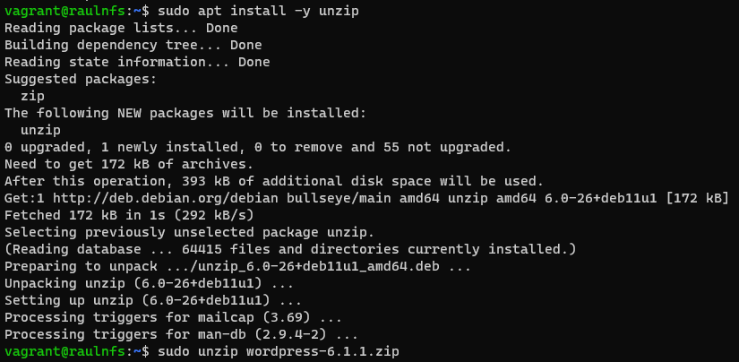
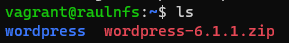

### 4.3 Creación de la carpeta a compartir.
Creamos una carpeta en la ruta /var/www que sera la que compartamos con las maquinas de nginx

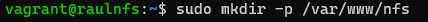

### 4.4 Copiar el wordpress en la nueva carpeta creada
Copiamos el contenido de la carpeta wordpress a la carpeta nfs creada anteriormente

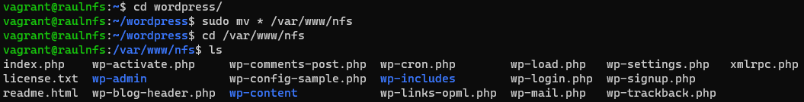

### 4.5 Configuración del fichero exports.
Modificamos el fichero exports que se encuentra en etc colocándoles las ips de las dos máquinas de nginx

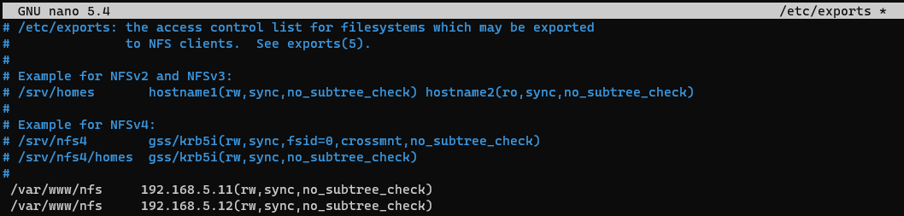

### 4.5 Configuración del fichero wp-config.php
Creamos una copia del fichero wp-config-sample.php y lo llamamos wp-config.php

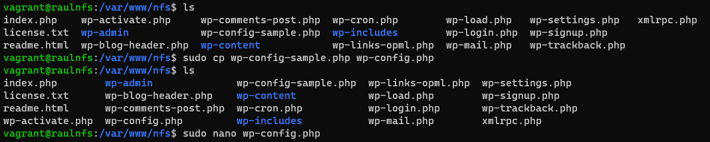

Luego modificamos el fichero creado colocando el usuario y la base de datos creada previamente y la ip de nuestra maquina mysql

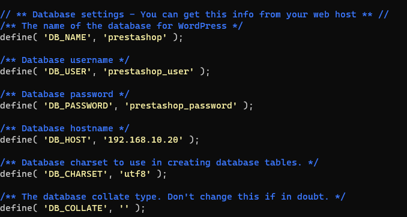

### 4.6 Configuración del fichero www.conf
Configuramos el fichero www.conf que se encuentra en la ruta /etc/php/7.4/fpm/pool.d y modificamos la línea "listen" y le añadimos la dirección 0.0.0.0 y el puerto 9000

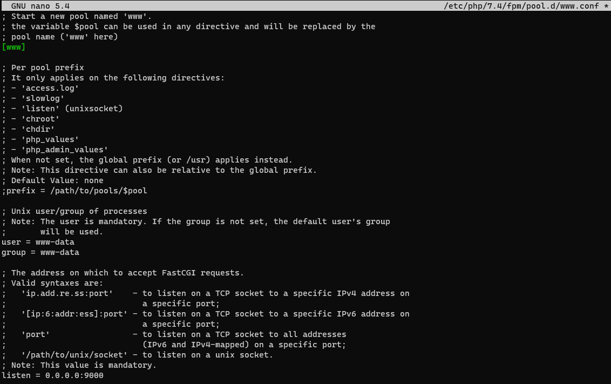

## 5. Configuración de la maquinas Nginx

### 5.1 Creación de la carpeta compartida y montaje de la misma.
Creamos la carpeta nfs en la ruta /var/www/

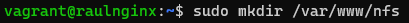

Montamos la carpeta

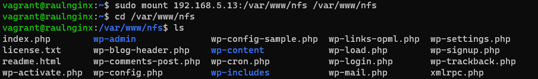

### 5.2 Configuración del fichero default que se encuentra en la ruta /etc/nginx/sites-enabled 
En este fichero pondremos la ruta de nuestra carpeta nfs de /var/www y bajaremos y agregaremos index.php al lado de index.html. Seguiremos bajando y habrá unas líneas que empiezan por location y estarán comentadas, las descomentamos, pero en la que pone \.php dejaremos comentada la de unix ya que es un socket que no necesitamos. En la otra línea de fatscgi_pass pondremos la IP de nuestro servidor NFS y el puerto 9000.

## 6. Configuración de la maquina Balanceador

### 6.1 Creación de claves certificadoras
Esta claves son necesaria para poder activar ssl en nginx para hacerlo hay que poner el siguiente comando:
sudo openssl req -x509 -nodes -days 365 -newkey rsa:2048 -keyout /etc/ssl/private/servernginx.com.key -out /etc/ssl/certs/servernginx.com.pem

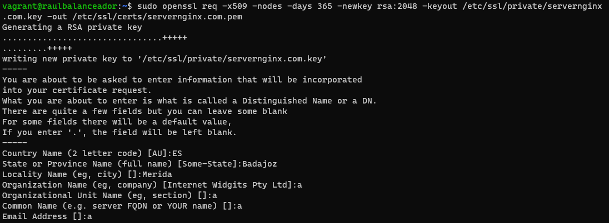

### 6.2 Creación del fichero de configuración
Lo primero es ir a /etc/nginx/sites-available y crear un nuevo fichero

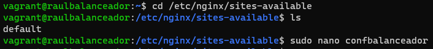

En el fichero escribir lo siguiente

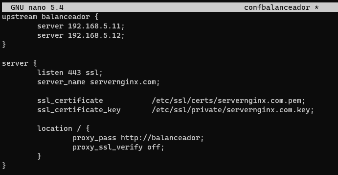

Lo siguiente será crear un enlace hacia sites-enabled y borraremos el default.

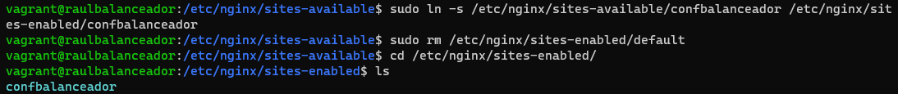

## 7. Comprobación

ip de la maquina balanceador

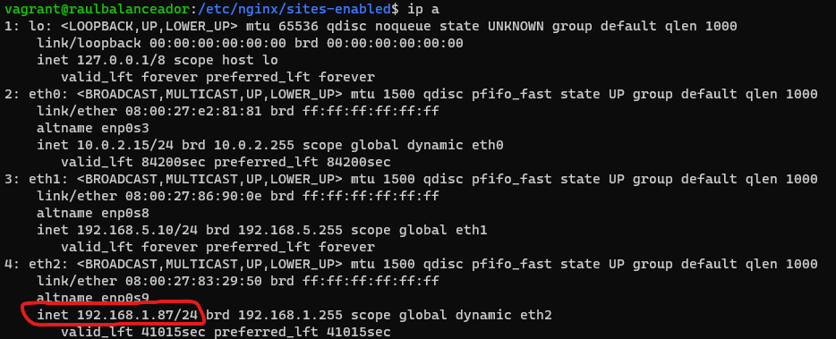

comprobación

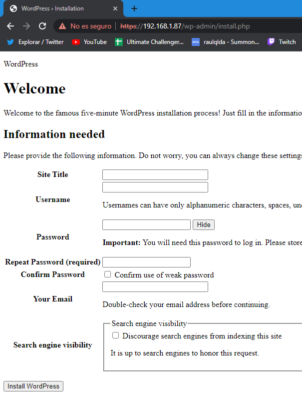
